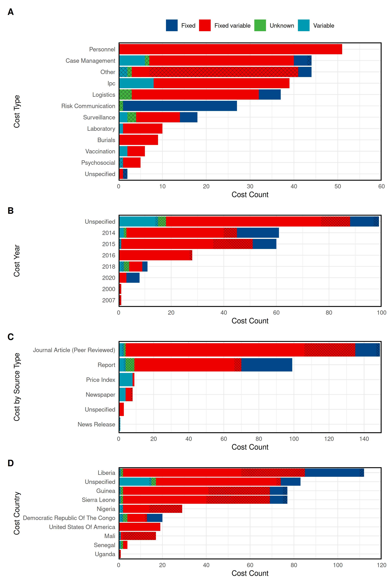

```{r, include = FALSE}
knitr::opts_chunk$set(
  collapse = TRUE,
  comment = "#>",
  fig.path = "man/figures/README-",
  out.width = "100%",
  warning = FALSE, 
  message = FALSE
)
```

# Welcome to the ERVEBOCOSTS repository

This repository is dedicated to extracting Ebola intervention cost data from a REDCap database instance (exported as an `xlsx` file). Cost data are stored in an awkward format, spread across varying numbers of columns, so this infrastructure provides helper functions for extracting information in a more user-friendly way.


## Getting started

You initially need to clone the repository:
```{bash eval = FALSE}
git clone git@github.com:thibautjombart/ervebocosts.git
cd ervebocosts
```

If you have done so already, make sure you use the latest version of *main* 
branch by typing, in a terminal opened in the root folder:
```{bash eval = FALSE}
git checkout main
git pull
```

The infrastructure is compatible with **R** version 4.5.2.
Helper functions are distributed as a dedicated package, so you should not have
to care about dependencies: these will be handled for you (see "Loading helper functions" below).


## Content of the repository

The main files and folders of the repository include:

- `README.Rmd`: the *rmarkdown* file generating the `README.md`
- `README.md`: this file, serving as main documentation for the repository
- `data/`: folder containing the cost data
- `R/`: folder containing R helper functions to exploit the data


## Loading helper functions

To load helper functions, and install all required dependencies, use:

```{r }
if (!require(devtools)) {
  install.packages("devtools")
}
devtools::install_deps(dependencies = TRUE, upgrade = "never")
devtools::load_all()
library(dplyr)
library(tibble)
library(tidyr)
library(ggplot2)
library(stringr)
library(patchwork)
library(forcats)
library(ggsci)
library(ggpattern)
```


## Accessing cost data

Cost data are stored as an export of a REDCap database, which is awkward to use
as-is. We provide a series of functions for importing and processing the data
in more usable formats. First, we import the data using the helper function
`import_data()`

```{r results = "hide"}
raw_data <- import_data()
```
```{r}
head(raw_data)
```

The content of the original database is outlined in the file `database_content.md`.


## Extracting cost items

The main helper function extracts (where available) data on the outbreaks and 
documented cost items:

```{r results = "hide"}
x <- get_cost_items(raw_data)
x <- as.data.frame(x)
```

```{r }
dim(x)
head(x)
```

This `data.frame` contains `r nrow(x)` cost items (rows) broken down as:

- `record_id`: unique ID of the record in the original REDCap database
- `source_type`: the type of data source
- `source_type_other`: more detailed information on data source
- `source_link`: DOI or URL of the data source
- `pathogen`: name of the pathogen the cost was recorded for
- `locations`: all locations of the recorded costs
- `year`: year the cost item was recorded
- `start_data`: if the cost item was recorded during an outbreak, the starting date of the outbreak
- `end_data`: if the cost item was recorded during an outbreak, the end date of the outbreak
- `cases`: if the cost item was recorded during an outbreak, the number of confirmed cases
- `deaths`: if the cost item was recorded during an outbreak, the number of deaths
- `sdbs`: if the cost item was recorded during an outbreak, the number of safe and dignified burials (SDBs)
- `vaccination`: if the cost item was recorded during an outbreak, the number of vaccine doses administered
- `tests`: if the cost item was recorded during an outbreak, the number of tests performed
- `admissions`: if the cost item was recorded during an outbreak, the number of admissions to healthcare facilities
- `contact_traced`: if the cost item was recorded during an outbreak, the number of contacts traced
- `cost_category`: the type of activity the cost corresponds to
- `cost_category`: finer-grain precisions on the activity the cost corresponds to
- `cost_summary`: a text-summary of the cost estimates and confidence intervals, if available, including currency used
- `cost_estimate`: the numerical value of the central estimate of the cost 
- `cost_lower`: the numerical value of the lower bound of the cost
- `cost_upper`: the numerical value of the upper bound of the cost

To subset data, we can use `dply::filter`. For instance, we can get data on 
Ebola-specific costs for IPC since 2018 using:
```{r}
x %>% 
  filter(pathogen == "Ebola", 
         year >= 2018, 
         cost_category == "ipc"
         )

```

The list of documented cost categories in the database is:
```{r}
pull(x, "cost_category") %>% unique() %>% sort()
```


The list of documented cost subcategories in the database is:
```{r}
pull(x, "cost_subcategory") %>% unique() %>% sort()
```

Summary plot of the type of cost estimates captured:

``` {r}
x <- get_cost_items(raw_data)

x$cost_class     <- classify_cost(x)
x$in_perspective <- cost_in_perspective(x)

x$source_type[!is.na(x$source_type) & x$source_type == "Other"] <- x$source_type_other[!is.na(x$source_type) & x$source_type == "Other"]
# Context: R + ggplot2 + ggpattern
x_plot <- x %>% 
  mutate(
    locations     = replace_na(locations, "Unspecified"),
    cost_category = replace_na(cost_category, "Unspecified"),
    source_type   = replace_na(source_type, "Unspecified"),
    source_type   = str_to_title(str_trim(source_type)),
    display_year  = if_else(!is.na(year), as.character(year), "Unspecified"),
    cost_category = str_to_title(str_replace_all(cost_category, "_", " ")),
    pattern       = if_else(in_perspective == 1, NA_character_, "stripe"),
    height        = 1
  )

# Reusable pattern styling parameters
pattern_style <- list(
  pattern_colour  = "black",
  pattern_fill    = "black",
  pattern_alpha   = 1,
  pattern_angle   = 45,
  pattern_density = 0.02,  # lower = thinner bands
  pattern_spacing = 0.02,  # keep spacing reasonable
  pattern_size    = 0.05   # lower = thinner stroke lines
)

# Reusable guides configuration
cost_guides <- guides(
  pattern = "none",                                        # hide pattern legend
  fill    = guide_legend(override.aes = list(pattern = "none")) # solid legend keys
)

# Reusable theme
cost_theme <- function() {
  theme_minimal() +
    theme(
      panel.border = element_rect(color = "black", linewidth = 1.25, fill = NA),
      legend.position = "top"
    )
}

p1 <- ggplot() +
  geom_bar_pattern(
    data = x_plot %>% 
      separate_rows(cost_category, sep = ",") %>%
      mutate(cost_category = str_trim(cost_category)),
    aes(
      x = reorder(fct_infreq(cost_category), cost_class),
      y = height,
      fill = cost_class,
      pattern = pattern
    ),
    stat = "identity",
    color = NA,
    pattern_colour  = pattern_style$pattern_colour,
    pattern_fill    = pattern_style$pattern_fill,
    pattern_alpha   = pattern_style$pattern_alpha,
    pattern_angle   = pattern_style$pattern_angle,
    pattern_density = pattern_style$pattern_density,
    pattern_spacing = pattern_style$pattern_spacing,
    pattern_size    = pattern_style$pattern_size
  ) +
  scale_x_discrete(limits = rev) +
  scale_y_continuous(limits = c(0, 60),
                     breaks = seq(0, 60, 10),
                     expand = c(0,0)) +
  xlab("Cost Type") + 
  ylab("Cost Count") +
  scale_fill_lancet(name = NULL) +
  cost_guides +
  cost_theme() +
  coord_flip()

p2 <- ggplot() +
  geom_bar_pattern(
    data = x_plot,
    aes(
      x = fct_infreq(display_year),
      y = height,
      fill = cost_class,
      pattern = pattern
    ),
    stat = "identity",
    color = NA,
    pattern_colour  = pattern_style$pattern_colour,
    pattern_fill    = pattern_style$pattern_fill,
    pattern_alpha   = pattern_style$pattern_alpha,
    pattern_angle   = pattern_style$pattern_angle,
    pattern_density = pattern_style$pattern_density,
    pattern_spacing = pattern_style$pattern_spacing,
    pattern_size    = pattern_style$pattern_size
  ) +
  scale_x_discrete(limits = rev) +
  scale_y_continuous(limits = c(0, 100),
                     breaks = seq(0, 100, 20),
                     expand = c(0, 0)) +
  xlab("Cost Year") + 
  ylab("Cost Count") +
  scale_fill_lancet(name = NULL) +
  cost_guides +
  cost_theme() +
  coord_flip()


p3 <- ggplot() +
  geom_bar_pattern(
    data = x_plot,
    aes(
      x = reorder(fct_infreq(source_type), cost_class),
      y = height,
      fill = cost_class,
      pattern = pattern
    ),
    stat = "identity",
    color = NA,
    pattern_colour  = pattern_style$pattern_colour,
    pattern_fill    = pattern_style$pattern_fill,
    pattern_alpha   = pattern_style$pattern_alpha,
    pattern_angle   = pattern_style$pattern_angle,
    pattern_density = pattern_style$pattern_density,
    pattern_spacing = pattern_style$pattern_spacing,
    pattern_size    = pattern_style$pattern_size
  ) +
  scale_x_discrete(limits = rev) +
  scale_y_continuous(limits = c(0, 150),
                     breaks = seq(0, 150, 20),
                     expand = c(0, 0)) +
  xlab("Cost by Source Type") + 
  ylab("Cost Count") +
  scale_fill_lancet(name = NULL) +
  cost_guides +
  cost_theme() +
  coord_flip()

# By cost country -- note that the not in perspective looks larger than in the other plots as those 
# estimates were jointly reported across all of those countries.
p4 <- ggplot() +
  geom_bar_pattern(
    data = x_plot %>%
      separate_rows(locations, sep = ",") %>%
      mutate(locations = str_trim(str_to_title(str_replace_all(locations, "_", " ")))),
    aes(
      x = reorder(fct_infreq(locations), cost_class),
      y = height,
      fill = cost_class,
      pattern = pattern
    ),
    stat = "identity",
    color = NA,
    pattern_colour  = pattern_style$pattern_colour,
    pattern_fill    = pattern_style$pattern_fill,
    pattern_alpha   = pattern_style$pattern_alpha,
    pattern_angle   = pattern_style$pattern_angle,
    pattern_density = pattern_style$pattern_density,
    pattern_spacing = pattern_style$pattern_spacing,
    pattern_size    = pattern_style$pattern_size
  ) +
  scale_x_discrete(limits = rev) +
  scale_y_continuous(limits = c(0, 120),
                     breaks = seq(0, 120, 20),
                     expand = c(0, 0)) +
  xlab("Cost Country") + 
  ylab("Cost Count") +
  scale_fill_lancet(name = NULL) +
  cost_guides +
  cost_theme() +
  coord_flip()


patchwork_plt <- (
  p1 / p2 / p3 / p4
) +
  plot_layout(ncol = 1, heights = c(3, 2, 2, 2), guides = "collect") +
  plot_annotation(tag_levels = "A") &
  theme(
    legend.position = "top",               # shared legend at top
    plot.tag = element_text(face = "bold") # bold A/B/C/D tags
  )

ggsave("man/figures/cost_count_figure.png", patchwork_plt, width = 8, height = 12, dpi = 300)


```


